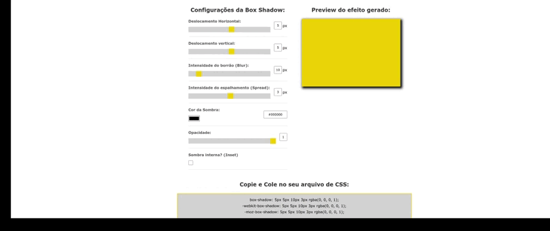

# Gerador de Box Shadow

Este é um simples gerador de `box-shadow` que permite a você visualizar e personalizar as propriedades da sombra de caixa em tempo real.

## Como Usar

1. Abra o arquivo `index.html` em seu navegador.
2. Use os controles deslizantes e caixas de texto para ajustar as propriedades da sombra da caixa.
3. A área de visualização (à direita) mostrará a sombra de caixa resultante.
4. Copie as regras geradas clicando na área de regras acima do botão "Clique no quadro acima para copiar as regras".
5. Cole as regras em seu arquivo CSS.

## Controles

- **Deslocamento Horizontal:** Ajusta o deslocamento horizontal da sombra.
- **Deslocamento Vertical:** Ajusta o deslocamento vertical da sombra.
- **Intensidade do Borrão (Blur):** Controla a intensidade do borrão da sombra.
- **Intensidade do Espalhamento (Spread):** Define a intensidade do espalhamento da sombra.
- **Cor da Sombra:** Escolha a cor da sombra usando a seleção de cores.
- **Opacidade:** Ajusta a opacidade da sombra.
- **Sombra Interna (Inset):** Ativa ou desativa a sombra interna.

## Preview

A área de visualização mostra a aparência da sombra da caixa conforme você ajusta os controles.

## Copiar as Regras

Clique na área de regras para copiar automaticamente as regras geradas para a área de transferência.

## Responsividade

O layout é responsivo e otimizado para dispositivos móveis com largura de tela de até 425 pixels.

## GIF final do projeto

